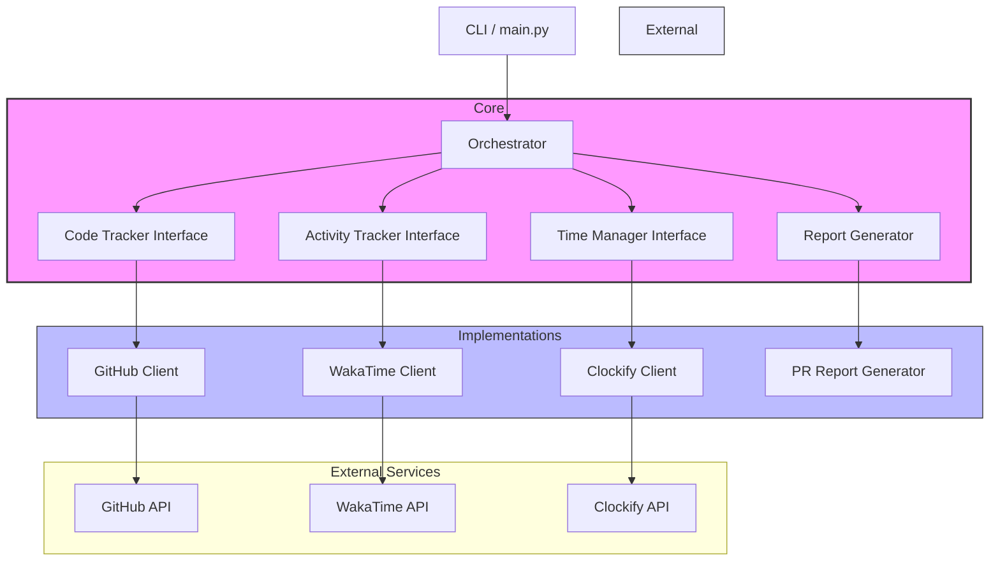
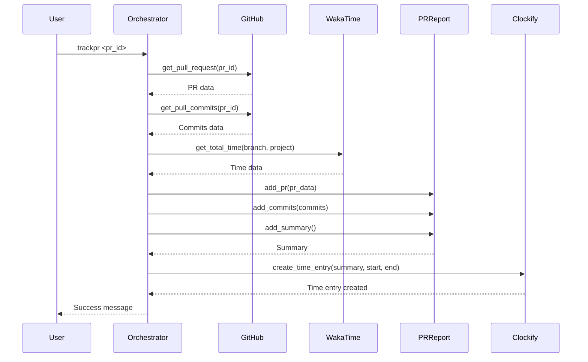

# Trackify Architecture

```mermaid
graph TD
    CLI[CLI / main.py] --> Orchestrator

    subgraph Core
        Orchestrator --> CodeTracker[Code Tracker Interface]
        Orchestrator --> ActivityTracker[Activity Tracker Interface]
        Orchestrator --> TimeManager[Time Manager Interface]
        Orchestrator --> ReportGenerator[Report Generator]
    end

    subgraph Implementations
        CodeTracker --> GitHub[GitHub Client]
        ActivityTracker --> WakaTime[WakaTime Client]
        TimeManager --> Clockify[Clockify Client]
        ReportGenerator --> PRReport[PR Report Generator]
    end

    subgraph External Services
        GitHub --> GitHubAPI[GitHub API]
        WakaTime --> WakaTimeAPI[WakaTime API]
        Clockify --> ClockifyAPI[Clockify API]
    end

    style Core fill:#f9f,stroke:#333,stroke-width:2px
    style Implementations fill:#bbf,stroke:#333,stroke-width:1px
    style External Services fill:#bfb,stroke:#333,stroke-width:1px
```

## Flow Diagram

```mermaid
sequenceDiagram
    participant User
    participant Orchestrator
    participant GitHub
    participant WakaTime
    participant PRReport
    participant Clockify

    User->>Orchestrator: trackpr <pr_id>
    Orchestrator->>GitHub: get_pull_request(pr_id)
    GitHub-->>Orchestrator: PR data
    Orchestrator->>GitHub: get_pull_commits(pr_id)
    GitHub-->>Orchestrator: Commits data
    Orchestrator->>WakaTime: get_total_time(branch, project)
    WakaTime-->>Orchestrator: Time data
    Orchestrator->>PRReport: add_pr(pr_data)
    Orchestrator->>PRReport: add_commits(commits)
    Orchestrator->>PRReport: add_summary()
    PRReport-->>Orchestrator: Summary
    Orchestrator->>Clockify: create_time_entry(summary, start, end)
    Clockify-->>Orchestrator: Time entry created
    Orchestrator-->>User: Success message
```
